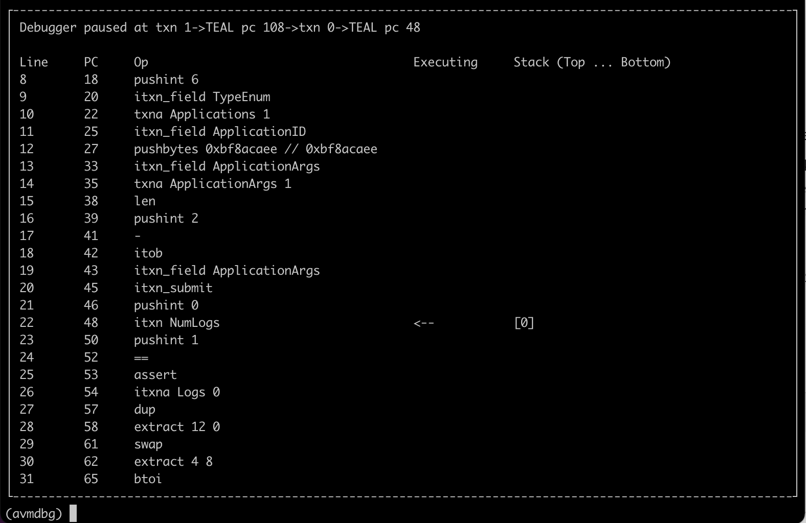

# AVM Debugger

The AVM Debugger, or avmdbg for short, is a debugger for the entire AVM. In contrast to tealdbg,
this debugger's scope includes the entire execution of a transaction group, not just TEAL evaluation.
Because of this, the debugger can step though both transactions and lines of TEAL code.



This project was made by [@jasonpaulos](https://github.com/jasonpaulos) during Algorand Inc's internal hackathon in April 2022.

## Building

The debugger is part of a go-algorand monorepo, so you'll need to follow the [Building from source](../../README.md#building-from-source) instructions for the top-level repo. After you run `make install`,
the `avmdbg` binary should be built and placed in the same location as other tools such as `goal`.

## Running

To run the debugger, you must first obtain a serialized signed transaction group. This can be
generated using `goal` or one of our SDKs.

The transaction group should be in one of the following formats (this is the same as dryrun and `tealdbg`):
* msgpack encoding of one or more signed transactions
* JSON encoding of an array of signed transactions
* JSON encoding of a single signed transaction

The file `demo.msgp` is provided as an example. This example was generated from TestNet, so you'll
want to use a TestNet algod below if you wish to debug it. You can use `goal clerk inspect demo.msgp` 
to view the contents of the transaction group.

To run the debugger, use the following command:

```bash
avmdbg --algod-url ALGOD_URL_HERE --algod-token ALGOD_TOKEN_HERE --txns TXN_GROUP_FILE_TO_DEBUG_HERE
```

The debugger will scan the input txn group for all the accounts, assets, and apps being accessed,
then it will load those resources using the algod node you provided. Note that the current version
of these resources are always used, so you must be aware of any recent changes to them that might
affect your transaction group behavior.

## Using

Once you launch the debugger, and after it loads the necessary resources from algod, you'll be
presented with the main screen.

You can enter "run" to start the debugger, and at any point you can enter "exit" to quit the
debugger.

**NOTE:** there is currently no breakpoint support. The debugger will pause at every operation and
you must enter "next" to step to the next operation. To make this easier, entering an empty line
(just hitting the return/enter key) will rerun the previous command, so you can proceed quickly by
pressing just one key.

## Future Improvements

Here's an unordered list of improvements that would be nice to add to this debugger:

* Breakpoints - the ability to set breakpoints on specific lines of code and specific transactions.

* Step over & step out - the ability to skip the execution of deeper steps and the ability to jump
  out of the current transaction group or TEAL program.

* Querying - one of the benefits of using a debugger like this is that you have the ability to ask
  complex question about the state of the world between operations. Currently this isn't implemented,
  but it would be great to let you ask questions about the status of account fields or app state at
  any point of the transaction group's execution.

* Support/switch to a new model for resource loading - a big downside of the current resource loading
  model is that your debugger experience is always dependent on the latest state of the blockchain.
  Instead, it would be nice if you could make a "snapshot" of the chain and include this with your debugger
  input. That way, you'll be able to debug the same input with the same result regardless of whatever
  the latest version of the chain says.

* The TxIDs of inner txns are likely wrong - since inner transaction IDs are calculated in a slightly
  different way, the current TxIDs shown for inner txns are likely wrong, since they use `transactions.Transaction.ID()`.